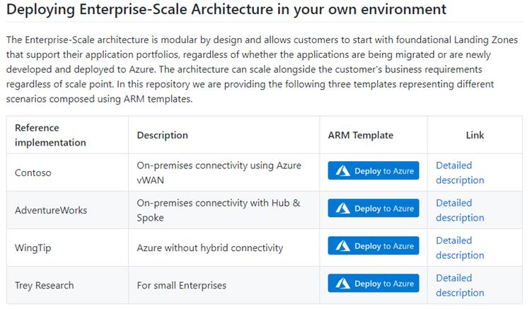
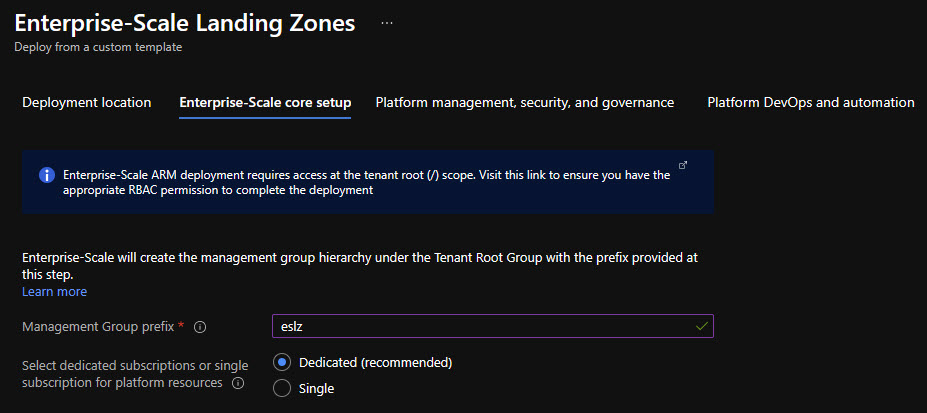
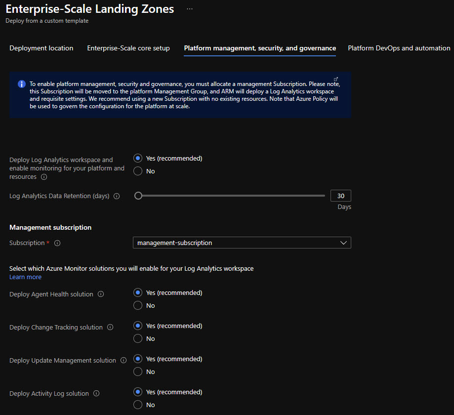
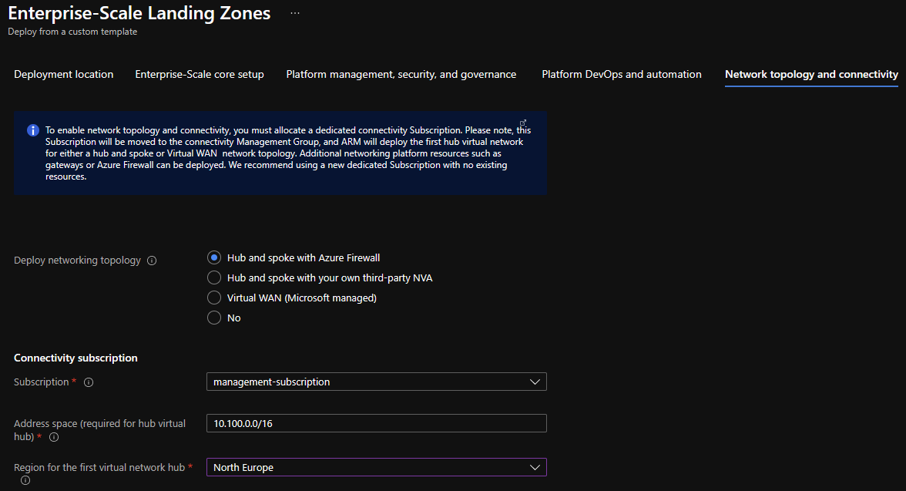
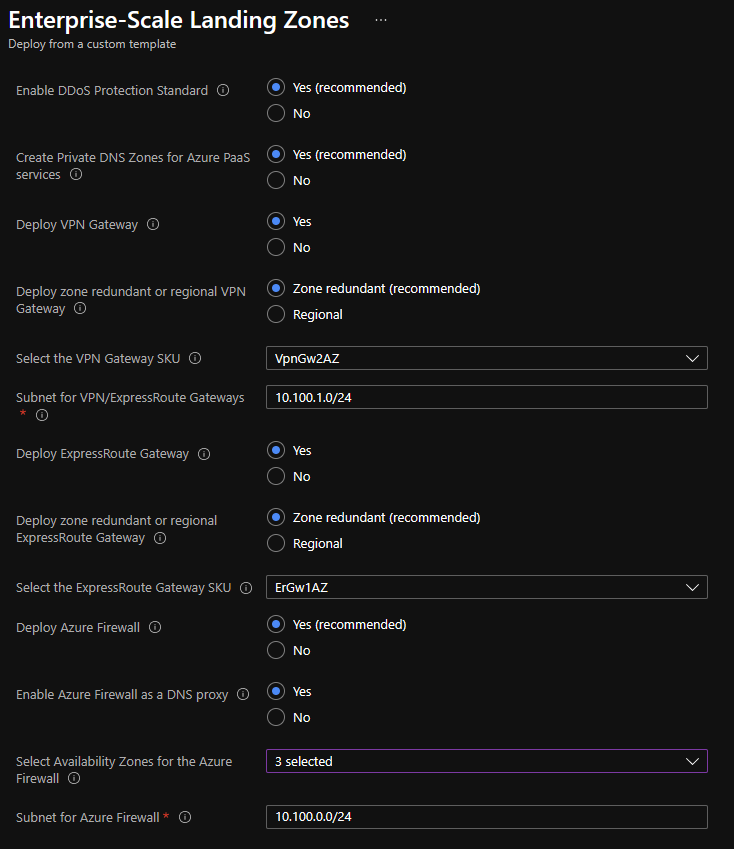
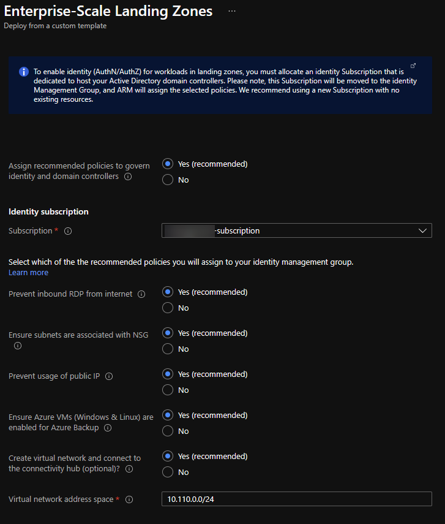
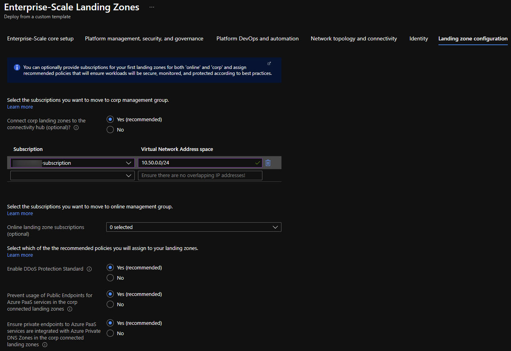

### In this Section

TBD: Enterprise Scale Deployment Accelerator is a bla, bla, bla. In this quickstart, you will implement an Azure foundation that provides your Landing Zones with connectivity on-premises datacenters and branch offices by leveraging a hub and spoke network topology.

Please refer to [Trey Research reference implementation](https://github.com/Azure/Enterprise-Scale/blob/main/docs/reference/treyresearch/README.md) for further details on the Azure foundation enabled in this tutorial.

### Pre-requisites

To provision your environment with the Deployment Accelerator, your user/service principal must have Owner permission at the Azure Active Directory Tenant root. See the following [instructions](./Deploying-Enterprise-Scale-Pre-requisites) on how to grant access before you proceed.

### Optional pre-requsites

The deployment experience in Azure portal allows you to bring in existing (preferably empty) subscriptions dedicated for platform management, connectivity and identity. It also allows you to bring existing subscriptions that can be used as the initial landing zones for your applications.

To learn how to create new subscriptions using Azure portal, please visit this [link](https://azure.microsoft.com/en-us/blog/create-enterprise-subscription-experience-in-azure-portal-public-preview/).

To learn how to create new subscriptions programmatically, please visit this [link](https://docs.microsoft.com/en-us/azure/cost-management-billing/manage/programmatically-create-subscription).

### Launch the Deployment Accelerator

Enterprise-Scale can be deployed both from the Azure portal directly, or from [GitHub](https://github.com/Azure/Enterprise-Scale#deploying-enterprise-scale-architecture-in-your-own-environment)

### Deployment location

On the first page, select the *Region*. This region will primarily be used to place the deployment resources in an Azure region, but also used as the initial region for some of the resources that are deployed, such as Azure Log Analytics and Azure automation.

### Enterprise-Scale core setup

Provide a prefix that will be used to create the management group hierarchy and platform resources, and select if you would use dedicated subscriptions or a single subscription for platform resources (please note that dedicates subscriptions are recommended). For this scenario, select Dedicated.

### Platform management, security, and governance

On the *Platform management, security, and governance* blade, you will configure the core components to enable platform monitoring and security. The options you enable will also be enforced using Azure Policy to ensure resources, landing zones, and more are continuously compliant as your deployments scales and grows. To enable this, you must provide a dedicated (empty) subscription that will be used to host the requisite infrastructure.

Please note that if you enable the "Deploy Azure Security Center and enable security monitoring for your platform and resources" option, you will need to provide an email address to get email notifications from Azure Security Center.

### Network topology and connectivity
On the *Network topology and connectivity* blade, you will configure the core networking platform resources, such as hub virtual network, gateways (VPN and/or ExpressRoute), Azure Firewall, DDoS Protection Standard and Azure Private DNS Zones for Azure PaaS services. To deploy and configure these network resources, you must select a network topology (for this scenario, select either "Hub and spoke with Azure Firewall" or "Hub and spoke with your own third-party NVA"), provide the address space to be assigned to the hub virtual network, select an Azure region where the hub virtual network will be created and provide a dedicated (empty) subscription that will be used to host the requisite infrastructure. For this example, we will select the "Hub and spoke with Azure Firewall" network topology.

 

Depending on your requirements, you may choose to deploy additional network infrastructure for your Enterprise-Scale landing zones platform. The optional resources include:

* DDoS Protection Standard
* Azure Private DNS Zones for Azure PaaS services
* VPN and ExpressRoute Gateways
  * If you choose to deploy either or both of these gateways, you will have the option to select the subnet to be dedicated for these resources, if you decide to deploy them as regional or zone-redundant gateways, as well as choose the right SKU based on your requirements
* Azure Firewall
  * If you choose to deploy Azure Firewall, you will have the option to select the subnet, select to deploy the Firewall as regional or zone redundant as well as indicate if you want to enable DNS Proxy in Azure Firewall

 

### Identity
On the *Identity* blade you can specify if you want to assign recommended policies to govern identity and domain controllers. If you decide to enable this feature, you do need to provide an empty subscription for this. You can then select which policies you want to get assigned, and you will need to provide the address space for the virtual network that will be deployed on this subscription. Please note that this virtual network will be connected to the hub virtual network via VNet peering. 

 

### Landing zones configuration

You can optionally bring in N number of subscriptions that will be bootstrapped as landing zones, governed by Azure Policy. You indicate which subscriptions will be bootstrapped as landing zones with a virtual network deployed and connected to the hub virtual network for corp connectivity. Virtual networks on these subscriptions will be connected to the hub virtual network using VNet peering, and if you deployed and enabled Azure Firewall as DNS proxy, DNS settings on these VNets will be configured with the Azure Firewall private IP address.

You can also indicate which subscriptions you would like to be bootstrapped as landing zones but without corp connectivity. Finally, you can select which policy you want to assign broadly to all of your landing zones.

As part of the policies that you can assign to your landing zones, the Enterprise-Scale Landing Zones deployment experience will allow you to protect your landing zones with a DDoS Standard plan, and for corp connected landing zones, you will have the option to prevent usage of public endpoints for Azure PaaS services as well as ensure that private endpoints to Azure PaaS services are integrated with Azure Private DNS Zones. 

### Platform DevOps and Automation

You can choose to bootstrap your CI/CD pipeline (GitHub with GitHub actions or Azure Devops). 

TBD: Bla, bla.

### Review + create

*Review + Create* page will validate your permission and configuration before you can click deploy. Once it has been validated successfully, you can click *Create*

### Post deployment activities

Once Enterprise-Scale has deployed, you can grant your application teams/business units access to their respective landing zones. Whenever there’s a need for a new landing zone, you can place them into their respective management groups (Online or Corp) given the characteristics of assumed workloads and their requirements.
